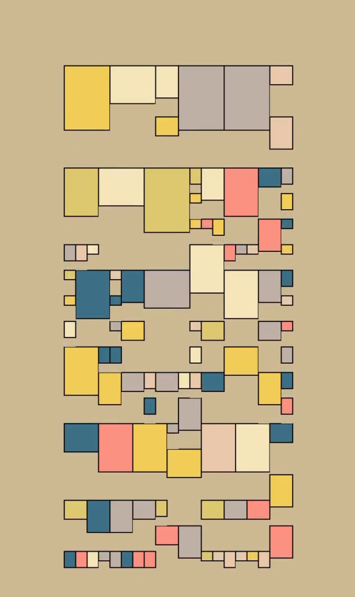
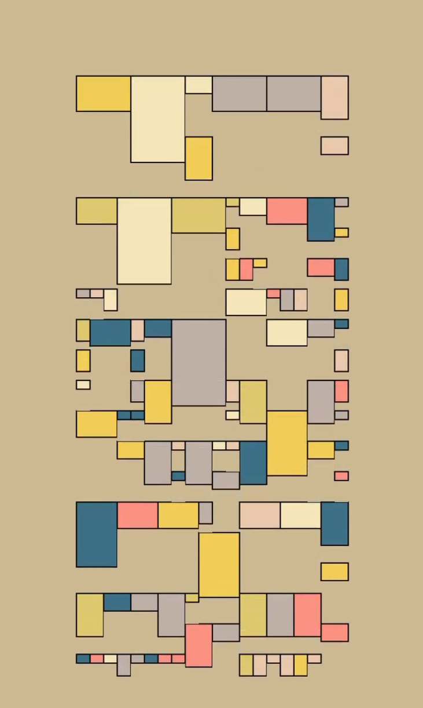
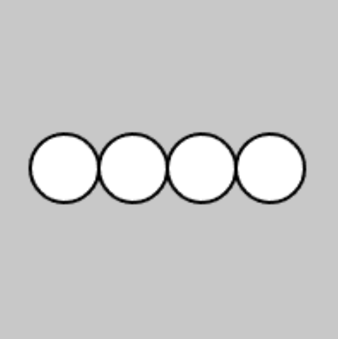

# zzha0024_9103_tut01
### This is my week8 quiz.

### Part 1 


[LinkText](https://www.instagram.com/p/CufT-J4ADle/)

This artwork from instagram, was generated in code by Chris Barber. The whole work is based on rectangles, which show a kind of regularity through dynamic expansion and change of rectangles. This dynamic nature also enhances the interest of the work.I want to incorporate the animation effects of stretching and moving rectangles into my final project. Especially for the artwork of Piet Mondrian's "Broadway Boogie Woogie," I want to simulate the improvisational and rhythmic qualities of jazz through the organized movement and stretching of squares. This will make the artwork more dynamic and engaging.

### Part 2


[LinkText](https://editor.p5js.org/graver/sketches/8cYH_MBQB)


[LinkText](https://p5js.org/reference/p5/Array/)


```
// Declare the variable xCoordinates and assign it an empty array.
let xCoordinates = [];

function setup() {
  createCanvas(100, 100);

  // Add elements to the array using a loop.
  for (let x = 20; x < 100; x += 20) {
    xCoordinates.push(x);
  }

  describe('Four white circles drawn in a horizontal line on a gray background.');
}

function draw() {
  background(200);

  // Access the element at index i and use it to draw a circle.
  for (let i = 0; i < xCoordinates.length; i += 1) {
    circle(xCoordinates[i], 50, 20);
  }
}
```

I doesn't find the code for the scaling rectangles. However, the above code can be adapted to mimic some of the effects of the first part of the image. First, the circle is changed into a rectangle, and the for loop and variable i are defined into several rows of rectangles of different sizes. Use the draw() function to animate. Use the variable y to control the position of the rectangle, controlling the speed of movement and the direction by changing the values of speed and direct. Use an if statement to make sure the rectangle bounces within a certain range.